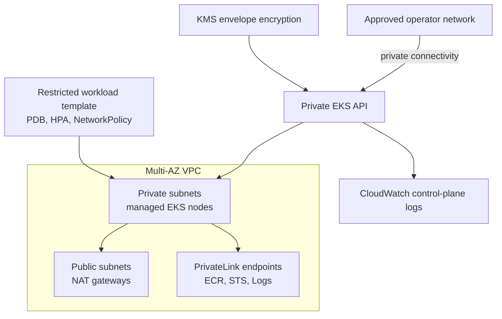

# AWS EKS Platform Blueprint

A security-first Terraform reference for operating a private Amazon EKS platform across multiple availability zones. It is intentionally a blueprint, not a one-command production deployment: account guardrails, approved CIDRs, IAM boundaries, cost ownership, and incident procedures must be reviewed by the team operating it.

## Portfolio focus

This project demonstrates the decisions expected in a platform/infrastructure interview: private cluster endpoints, private worker nodes, encrypted secrets and control-plane logs, multi-AZ network design, VPC endpoints, workload security, default-deny networking, and repeatable CI validation. It does not claim a real production deployment, availability result, or benchmark.

## Architecture



See [design notes](docs/architecture/overview.md) for trust boundaries and trade-offs.

## What is included

| Area | Implementation |
| --- | --- |
| Network | Explicit multi-AZ public/private subnets, NAT per AZ by default, gateway/interface VPC endpoints |
| EKS | Private API endpoint, managed node group, control-plane audit logs, AWS-managed addons |
| Encryption | KMS key rotation, EKS secret envelope encryption, encrypted CloudWatch log group |
| Workloads | Pod Security Admission labels, non-root/read-only container, requests/limits, PDB and HPA |
| Network policy | Default deny with explicit DNS and in-namespace ingress allowance |
| Delivery | Terraform formatting/validation, Kustomize render, IaC scanning, Dependabot |

## Repository layout

```text
environments/dev/  Example composition and remote-state configuration template
modules/network/   VPC, subnets, routing, NAT, and VPC endpoints
modules/eks/       EKS control plane, managed node group, logs, and encryption
kubernetes/        Secure workload template and namespace network policies
docs/              Architecture, operations, and runbooks
scripts/           Reproducible local validation
```

## Prerequisites

- Terraform `>= 1.7, < 2.0`
- AWS credentials obtained through short-lived, least-privilege federation
- `kubectl` for manifest rendering and cluster administration
- Private network access to the cluster API after provisioning

Do not use long-lived IAM access keys in `terraform.tfvars`, environment files, or CI. Use workload identity/OIDC in CI and an approved remote backend.

## Bootstrap a non-production environment

1. Copy the sample files. Keep the resulting files untracked.

   ```bash
   cp environments/dev/terraform.tfvars.example environments/dev/terraform.tfvars
   cp environments/dev/backend.hcl.example environments/dev/backend.hcl
   ```

2. Create the state bucket and KMS key through your organization’s approved bootstrap process. State must be encrypted, locked, versioned, and isolated per environment. Review `backend.hcl` before initializing.

3. Authenticate with a short-lived role and validate before planning.

   ```bash
   terraform -chdir=environments/dev init -backend-config=backend.hcl
   terraform -chdir=environments/dev plan -out=tfplan
   ```

4. Have a second reviewer inspect the plan for CIDRs, NAT count, KMS resource changes, cluster endpoint access, and node scaling. Apply only through the agreed change process:

   ```bash
   terraform -chdir=environments/dev apply tfplan
   ```

5. From a permitted private network, configure `kubectl` and render/apply the workload template only after reviewing its image and policy requirements.

   ```bash
   kubectl kustomize kubernetes | kubectl apply -f -
   ```

## Validation

```bash
./scripts/validate.sh
```

The GitHub Actions workflow repeats Terraform format/validation and Kustomize rendering. It also runs Checkov as a review signal; findings must be triaged in the pull request rather than ignored silently.

## Operational constraints and cost

- A NAT gateway per AZ improves failure isolation but costs more. The `dev` example permits a single NAT gateway only to make the trade-off explicit; never carry that setting into a production environment by default.
- A private EKS endpoint requires planned operator connectivity such as a VPN, Direct Connect, or a tightly controlled administrative network. Lack of this path is a common operational lockout.
- The node role currently uses AWS managed policies for simplicity. Before a production rollout, move CNI permissions to IRSA/EKS Pod Identity and scope workload AWS access to dedicated service accounts.
- The example uses an unpinned container tag only as a workload template. Production delivery should pin by immutable digest and use an approved internal registry.

## Security boundaries

- No public Kubernetes API endpoint.
- No automatic Terraform apply in CI.
- No secrets, state, kubeconfig, or account IDs committed to the repository.
- The Terraform state backend is deliberately external to the sample and must be created with encryption, locking, and least privilege.
- Kubernetes default-deny policies are only enforced if the selected CNI supports NetworkPolicy; validate that capability before relying on them.

Read [SECURITY.md](SECURITY.md), the [operations guide](docs/operations.md), and [runbooks](docs/runbooks/) before adapting this reference.

## License

MIT. Copyright (c) 2026 Hamidreza Mohammadi.
